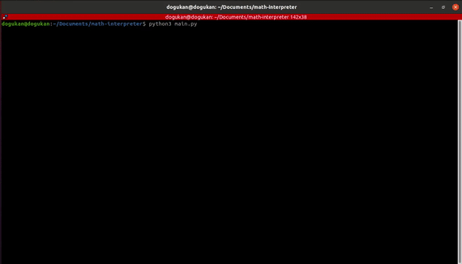

# Math Interpreter

A command-line interface of a calculator. It supports:
* addition, subtraction, multiplication, division, power
* trigonometric functions (sin, cos, tan, cot, sec, csc)
* history which lets you visit the previous operations via arrow keys

## Contribution

All of the contributions are welcomed. There are many more operations that can be implemented to this interpreter. If you see a functionality that this interpreters lacks of, please open an issue. If it is approved, then you can open a PR. Also, this may and probably contains bugs. If you encounter a bug, please do not hesitate to report via openning an issue.

## License

Released under the revised MIT LICENSE. See [LICENSE](LICENSE) for details.
